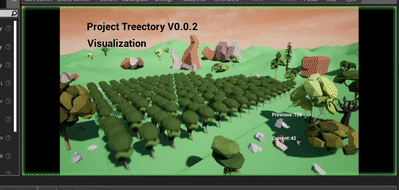
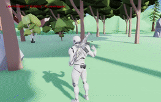

# Treectory
An educational program intends to increase the general public’s environmental awareness.
 
## Summary:
Our Treectory app is to raise people’s awareness of  energy saving by giving them a direct and visible way to evaluate the ecosystem cost from our daily activities. 
 We first extract energy consumption data from different devices’ application programming interface(API). Take a PC for example, we generate a detailed battery usage report as a .xml file.
 We uses the relationship between the electricity consumption and how many trees are needed to offset the negative effects. We also implemented a mathematical model to calculate changes of the tree total: current energy consumption is compared average consumption of all users from the database. Each factor is carefully assigned with a weight.
 
 Demo Video: [](https://youtu.be/FXXF8b94iDQ)


## Install
Our program is only compatible with python 3 for now and contains two test/show cases. 
`clone` or `download` the whole repository as zip file. 

Due to the upload limitation of Github, the visualization module(UE4 part) has to be downloaded from the following Google Drive link https://drive.google.com/open?id=1K5HhHaj8vBUi2Ef9qB38Sa0u655frgdS. After downloading, unzip this file and replace the original visual folder.

## Beta Test

To see tree number decreases, run
```
python3 main.py 1
```
To see tree number increases, run
```
python3 main.py 2
```
To extract pc power consumption, run (this feature only works in Windows 8 or 10)
```
python3 pc.py
```


## Further improvement

### Data
	
1. With the development and popularization of the smarthome, we can gain more energy consuming data on other devices, such as lighting, cooling, and heating systems. For example,  we can get Tesla’s, air conditioner’s, heater’s real time electricity consumption. Other form of energy using can also take into account, such as fuel, water
2. With a more sophisticated database, we can generate energy consumption reports, perform series of statistical analysis, and predict energy consumption trends in both micro and macro scopes.


### Visualization (with preview)
1. We can add more elements and environments, such as decorations on trees (act like skin in games), factories, outer-space exploration in our app. We can also implement a complete incentive mechanism to make the game more interactive which will motivate the users to save more energy or buy the features they want. Some of the profits can be donated to the environmental friendly charity.
2. Due to limited time, we only visualize the data on the UE4 which requires a high performance computer to run. We can also implement the game on mobile phones or other portable devices.

### Just for fun

Thanks to the great potential of Unreal Engine 4, this program can also be adapted to TPS game. Users can go to others` map, or they can invite others into their maps for combat. The randomized allocation of trees not only just for landscape view, they can also strategically places tree to change terrain features to gain advantages.



Moreover, a dynamic weather system may also be implemented in the future.


